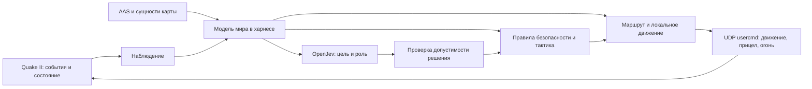

# План: OpenJev как кооперативный напарник

## Цель и граница текущей версии

Цель: второй игрок под управлением OpenJev помогает человеку сражаться и проходить кампанию Quake II, не забирая у него инициативу. Существующий UDP-клиент остаётся исполнительным телом; сервер отдаёт наблюдения; харнес хранит модель мира, строит маршруты и выполняет действия.

Сейчас `tools/openjev_controller.py` получает здоровье, позиции, видимых врагов и ближайшие предметы. Раз в секунду он просит модель выбрать букву из `attack`, `heal`, `retreat`, `follow`, `hold`. Наведение и прямолинейное движение заданы кодом. Нет памяти о врагах, графа проходов, целей уровня, оценки укрытия и кооперативного плана. Поэтому дальнейшая работа должна менять наблюдение и исполнительный слой, а не только формулировку промпта.

## Разделение ответственности

OpenJev выбирает *что* делать: следовать, прикрывать, занять позицию, атаковать конкретную угрозу, подобрать нужный ресурс, помочь с препятствием, ждать игрока или идти к следующей цели. Ему дают цель и ограниченный набор доступных объектов. Харнес решает *как*: безопасный маршрут, локальные обходы, прицеливание, очередь выстрелов, прыжок/use, остановка при потере видимости. Эти быстрые операции выполняются без ожидания инференса.

## Этап 0. Измерить нынешнее поведение

- Записывать для каждого решения: состояние мира, кандидатов, ответ OpenJev, выбранную цель, валидность, задержку, фактические `usercmd`, прогресс и причину смены действия.
- Сделать воспроизводимый replay на `base1` и `base2` с одинаковыми seed и маршрутами человека. Отдельно собирать короткие ручные игровые сессии.
- Фиксировать: время рядом с игроком, успешные выстрелы по угрозам игрока, помощь при низком HP, блокирование прохода/линии огня, зависания, переходы карты, долю времени без полезной цели.

Результат этапа: baseline, с которым можно сравнивать каждое улучшение. Логи прежних тестов с BotLib-ботами не смешивать с режимом «только OpenJev».

## Этап 1. Дать харнесу модель мира

**Статическая часть при загрузке карты:** области и связи AAS, типы переходов (ходьба, прыжок, лестница, лифт), стоимость ребра, двери/кнопки, точки выхода и смены уровня, места предметов. Использовать уже имеющуюся выгрузку `coopbot_map_model` как основу; добавить машинный формат с версиями карты и стабильными ID. Не заставлять модель читать тысячи сырых строк графа.

**Динамическая часть:** позиции/скорости/HP игроков и видимых врагов, последний известный сектор скрывшегося врага с временем наблюдения, оружие/патроны, активность предметов, состояние дверей и платформ, опасные зоны и занятые проходы. Различать «видно сейчас», «помню» и «не знаю»; не передавать моделью знание о невидимых монстрах как факт.

**Состояние прохождения:** текущая карта, посещённые сектора, открытые проходы, использованные кнопки, доступные выходы, необходимые ключи/триггеры и пройденные цели. После смены уровня хранить только относящиеся к кампании факты.

Проверка: на известных картах сравнить экспортированный граф и связи с AAS; replay должен восстановить одинаковое состояние мира из одного потока событий.

## Этап 2. Сделать движение осмысленным

- Планировать путь по AAS от текущей области до области цели. Сначала A* с ценой времени, опасности и препятствий; при изменении дверей/платформ пересчитывать затронутый путь. D* Lite рассматривать позже, только если профилирование покажет, что частые полные пересчёты дороги.
- Исполнять путь маленькими участками с проверкой видимости/коллизии; для лифта и двери нужны отдельные состояния `approach`, `wait`, `board/use`, `ride`, `exit`.
- Определять `stuck` по отсутствию прогресса, пробовать локальный обход, затем перепланирование и только потом отказ от цели. Не продолжать бесконечно бежать в стену.
- Держать допустимую дистанцию до человека и не вставать в дверном проёме либо между игроком и его целью.

Проверка: маршруты `base1`/`base2` с дверью, поворотом и лифтом; каждый провал содержит участок пути, причину и последнюю позицию. Отдельный живой тест лифта нужен, поскольку прежний natural BotLib probe был нестабилен.

## Этап 3. Боевой исполнитель и кооперация

- Оценивать угрозу по близости к человеку, наносимому урону, линии огня, типу монстра и доступности подходящего оружия. Приоритет: угроза игроку и самозащита; не гнаться за далёкой целью через карту.
- Выбирать безопасную огневую позицию с видимостью врага и без перекрытия огня игрока. Перед каждым выстрелом проверять живость/видимость цели, дружественную линию и ресурс оружия.
- Разделить действия `cover_player`, `focus_player_target`, `hold_flank`, `retreat_together`, `fetch_health/ammo`, `regroup`; каждое действие имеет условие начала, завершения, таймаут и причину прерывания.
- Если человек ранен или отступает, менять позицию и приоритет угроз; если человек подбирает предмет или решает задачу, не забирать предмет и не активировать механизм раньше него без необходимости.

Проверка: зафиксированные ситуации «игрок под огнём», «два врага», «узкий проход», «мало здоровья», «общая цель». Проверять не только число выстрелов, но и снижение угрозы игроку, отсутствие friendly-fire/блокировок и понятную смену роли.

## Этап 4. Цели уровня и решения OpenJev

- Построить граф целей карты: достижимые сектора, предметы для доступа, кнопки/двери, выход. Для начала вручную описать один маршрут `base1`, затем извлекать связи из `target -> targetname` и проверять на следующей карте.
- Раз в несколько секунд или при значимом событии передавать OpenJev компактную сводку: ближайшие цели, угрозы, состояние игрока, возможные маршруты и память плана из следующего раздела. Попросить выбрать `role`, `goal_id`, `target_id`, `reason`, `valid_until` через JSON Schema. Ollama поддерживает ограничение ответа схемой; результат всё равно проверять против текущего состояния.
- Зафиксировать порядок приоритетов: выживание и кооперация, затем задача уровня. Дать модели право предложить инициативу, но исполнитель отклоняет недоступную цель, устаревший ID или действие, мешающее игроку.
- Добавить «память намерения»: не менять план каждый запрос, пока он допустим и есть прогресс; при тупике сообщать модели причину и новые варианты.

Проверка: OpenJev проходит выбранный участок вместе с человеком, ждёт при отставании и не пытается завершить уровень в одиночку. Отчёт сравнивает тот же исполнитель с OpenJev и с детерминированным выбором цели: так видно реальную пользу модели.

### Память и устойчивый план

**Первый прототип выполнен:** `tools/openjev_controller.py` теперь хранит ограниченную историю событий и недавно виденных врагов, а медленный планировщик удерживает `advance`, `cover`, `regroup`, `recover` или `wait` минимум до значимого события либо истечения интервала. OpenJev получает этот план в промпте и выбирает быстрое действие из допустимых вариантов. В живой сессии зафиксирован переход `advance -> wait` после смерти человека.

**Первый маршрутный срез выполнен:** `tools/openjev_navigation.py` читает локальный AAS, ищет пеший маршрут и передаёт точки переходов исполнителю `follow`/`heal`. На `base1` для ситуации со стеной построен путь из четырёх переходов; в чистой живой сессии OpenJevMate сдвинулся с `(128, -320)` до `(105, -166)` и продолжил движение. Поддержки динамических дверей, платформ и всей кампании пока нет.

Текущий вызов `choose_action` передаёт только свежий снимок; предыдущая цель и её исход в промпт не попадают. Добавить в харнес три уровня памяти:

1. **Краткая история наблюдений, 10–30 секунд:** куда шёл игрок, кто первым атаковал, где видели исчезнувшего врага, изменилось ли здоровье, открылась ли дверь, был ли прогресс по пути. Хранить структурированными событиями с временем и уверенностью, а не длинным текстовым логом.
2. **План на текущую карту:** активная цель, роль, маршрутные этапы, ожидаемый результат, дедлайн, число неудачных попыток и причина последнего перепланирования. Пример: `прикрыть игрока у двери -> дождаться открытия -> войти следом -> занять левую позицию`.
3. **Память кампании:** уже пройденные переходы, полученные ключи, длительные предпочтения игрока (осторожный/быстрый, собирает предметы/идёт к выходу). Хранить только проверенные факты и ограниченный итог эпизодов; сбрасывать нерелевантные детали при смене карты.

В запросе к OpenJev показывать **текущую цель, прогресс, последние значимые события и доступные следующие шаги**. Ответ схемы должен выбирать `continue`, `revise` или `abort`, а при пересмотре — новую цель и причину. Исполнитель держит цель несколько секунд и до следующего контрольного события; «следовать» и «атаковать» становятся подзадачами общего плана. Немедленно прерывать план разрешено при угрозе жизни, потере доступности пути, критическом состоянии игрока или явной новой команде.

Защита от хаоса: минимальное время удержания роли, порог полезности для смены цели, cooldown после неудачной попытки, запрет повторять цель после нескольких одинаковых тупиков. Стратегия не должна появляться из бесконечного промпта; состояние плана хранится в коде и переживает каждый вызов модели.

Проверка: на одном replay после краткого исчезновения врага бот не скачет `attack/follow/retreat` каждый запрос; после открытой двери продолжает маршрут; после недоступного лифта меняет маршрут с записанной причиной. В trace видны `goal_started`, `goal_progress`, `goal_completed`, `goal_aborted` и `replan_reason`.

## Этап 5. Улучшать по данным, а не по впечатлению от одного боя

- Replay/регрессионный набор из коротких эпизодов: навигация, combat, cover, ресурсы, двери/лифты, выход, смерть/возрождение. Отдельно держать карты и эпизоды, не использованные при настройке.
- После каждого этапа проводить минимум одну живую игровую сессию и пакет повторяемых seed. Сравнивать исходные события и видеозапись/наблюдение, поскольку телеметрия не гарантирует, что поведение выглядит разумным.
- Только после стабильной модели мира и действий рассмотреть обучение: ранжирование целей по размеченным игровым эпизодам, imitation learning для выбора ролей или RL в ускоренном симуляторе. Не обучать низкоуровневое движение на сырых UDP-кадрах до появления надёжного replay и функции награды, учитывающей кооперацию.

## Первый практический срез

1. Экспортировать AAS-граф и динамические события в один версионированный `WorldSnapshot` для OpenJevMate.
2. Реализовать A* и `follow_player` с обходом стен, прогрессом и `stuck`-перепланированием.
3. Добавить `cover_player` и `attack_visible_threat` с безопасной огневой позицией.
4. Ввести схему решения OpenJev и сравнить её с детерминированным выбором на тех же эпизодах.

Это должно дать заметное улучшение раньше, чем полная система целей кампании. Проверка первой версии: на `base1` напарник следует по маршруту вокруг препятствия, несколько раз занимает полезную позицию в бою и возвращается к игроку после боя; все переходы видны в replay.

## Источники для технических решений

- Текущая архитектура и ранее собранные ограничения: `docs/quake2_coop_ai_companion_plan.md`, `docs/testing/q2_client_harness.md`.
- AAS и обработка reachability/movers в исходном коде id Software: https://github.com/id-Software/Quake-III-Arena/blob/master/code/botlib/be_ai_move.c
- Ограниченные JSON-ответы Ollama: https://github.com/ollama/ollama/blob/main/docs/capabilities/structured-outputs.mdx
- D* Lite как возможная последующая оптимизация перепланирования: https://publications.ri.cmu.edu/d-lite
